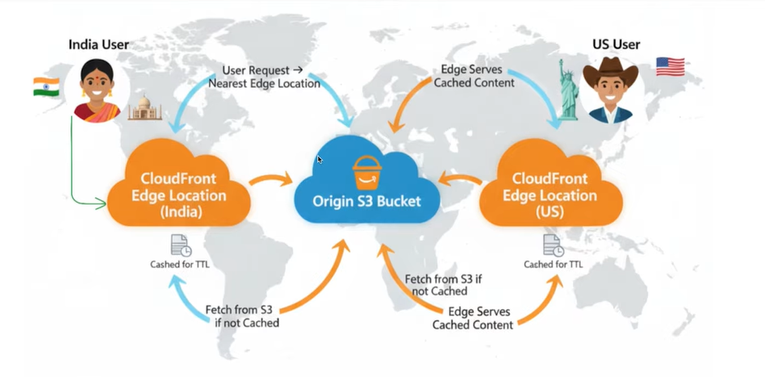
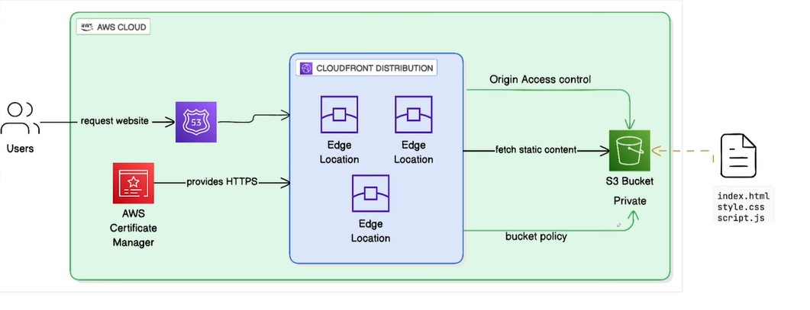
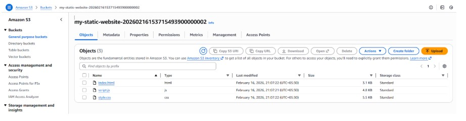
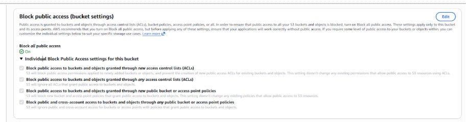
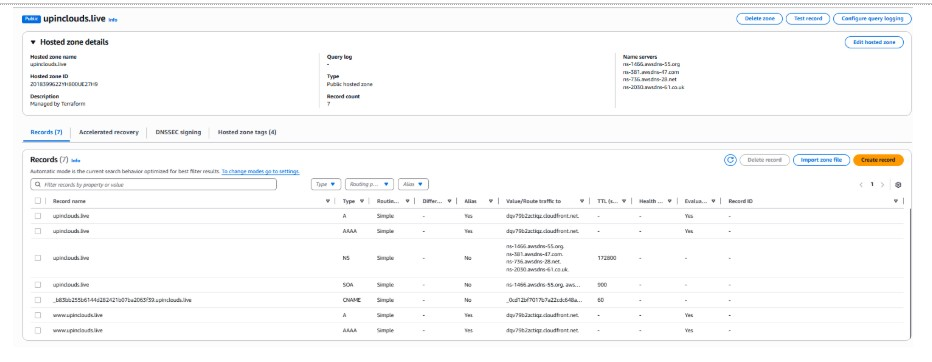
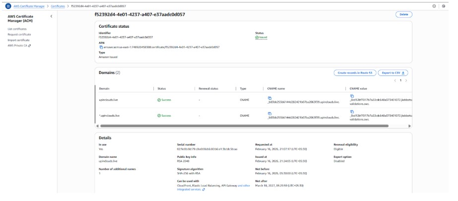
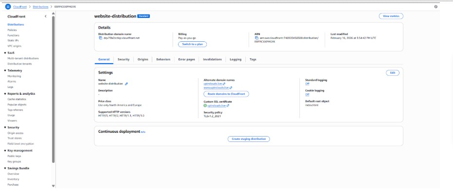
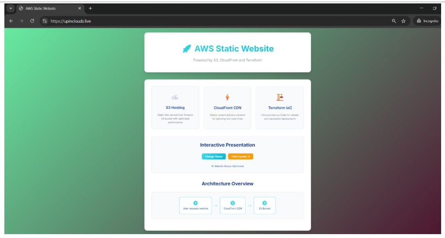

# Hosting a Static Website on AWS S3 and CloudFront Using Terraform

## Secure. Scalable. Declarative. Production-aligned.

## 🎯 Project Overview

This project demonstrates how to deploy a production-ready static website on AWS using Terraform.


## User Traffic Flow:

The following diagram illustrates the request flow from user to the S3 origin:




## 🏗️ Architecture

```
User → Internet → Domain → CloudFront Distribution → S3 Bucket (Static Website)
```




### Components:
- **Private S3 Bucket**: Hosts static website files (HTML, CSS, JS) and is not directly accessible to the public
- **CloudFront Distribution**: Global CDN for fast and secure content delivery
- **Origin Access Control (OAC)**: Secures authentication between CloudFront and S3


## 📁 Project Structure

```
Website_Infra/
├── provider.tf         # Provider Configuration
├── main.tf             # Main Terraform configuration
├── variables.tf        # Input variables
├── terraform.tfvars    # Default variable values (separates configuration from infrastructure code)
├── outputs.tf          # Output values
├── README.md           # This file
└── www/                # Website source files
    ├── index.html      # Main HTML page
    ├── style.css       # Stylesheet
    └── script.js       # JavaScript functionality
```


## 🚀 Features

### Website Features:
- **Modern Responsive Design**: Works on desktop and mobile
- **Dark/Light Theme Toggle**: Switch between themes (saves preference)
- **Interactive Elements**: Click counter, status updates
- **AWS Branding**: Professional layout showcasing AWS services
- **Animations**: Smooth transitions and loading effects

### Infrastructure Features:
- **S3 Static Website Hosting**: Reliable file storage and serving
- **CloudFront CDN**: Global content delivery with HTTPS
- **Proper MIME Types**: Correct content-type headers for all files
- **Private Origin Architecture**: S3 accessible only through CloudFront


## 🛠️ Prerequisites

1. **AWS CLI** configured with appropriate credentials
2. **Terraform** installed (version 1.0+)
3. **AWS Account** with sufficient permissions for:
   - S3 bucket creation and management
   - CloudFront distribution creation
   - IAM permissions to manage S3, CloudFront, Route53, and ACM resources


## 📋 Deployment Steps

**Step 1: Create a folder named `Website_Infra`, and inside it create another folder named `www`:** 

Add the following three files: 

1. ``index.html`` : The code for `index.html` is available in this repository.

2. ``style.css`` : The code for ``style.css`` is present in this repository. 

3. ``script.js`` : The code for ``script.js`` is present in this repository.


**Step 2: Inside “Website_Infra” folder add the code for provider configuration:** 

```
provider.tf
```

Then run `aws configure` in your terminal and provide your Access Key ID, Secret Access Key, region, and default output format.


**Step 3: In the same Root Folder that is “Website_Infra”, create a file named `main.tf` and:** 

1. Add HCL Configuration for Creating an S3 Bucket.

2. Make this bucket as private: 

- Refer to the Terraform AWS Provider documentation for: `aws_s3_bucket_public_access_block`

3. Origin Access Control for CloudFront: 

- Refer to the Terraform AWS Provider documentation for: `aws_cloudfront_origin_access_control`

4. Bucket Policy for S3: 

- Refer to the Terraform AWS Provider documentation for: `aws_s3_bucket_policy`

``https://awspolicygen.s3.amazonaws.com/policygen.html``

* Copy the Policy and Paste It.

5. Uploading Static Files to S3: 

    Search for “aws_s3_object”. Copy / Paste and then make the changes.

6. Create Route53 Hosted Zone for domain management. 

7. Create ACM Certificate for CloudFront (must be in us-east-1 region).

8. Create CloudFront Distribution for S3 Origin with HTTPS.

9. Initialize Terraform: “terraform init”: 

```
cd Website_infra
terraform init
```

10. Validate the Configuration:

```
terraform validate
```

11. Review the execution plan output carefully before applying: 

```
terraform plan -out tfplan
```

12. Apply the changes:

**Deploy Infrastructure**

```
terraform apply tfplan
```

Type yes when prompted to confirm deployment.

13. Access Your Website

- After deployment completes, Terraform will output the Website URL.

* Note: Remember to update your Route53 nameservers in your domain provider. 

## 📊 Resources Created

| Resource Type | Purpose | Count |
|---------------|---------|-------|
| S3 Bucket | Website hosting | 1 |
| S3 Bucket Policy | Restricts access to CloudFront only | 1 |
| S3 Objects | Website files (HTML, CSS, JS) | 3 |
| CloudFront Distribution | Global CDN | 1 |

## 🔧 Configuration Details

### S3 Configuration:
- **Bucket naming**: Auto-generated with prefix `my-static-website-`
- **Website hosting**: Enabled with `index.html` as default
- **Public access**: Fully blocked; access allowed only via CloudFront (OAC)
- **Content types**: Proper MIME types for web files

### CloudFront Configuration:
- **Origin**: S3 bucket regional domain
- **Caching**: Standard web caching (1 hour default TTL)
- **HTTPS**: Automatic redirect from HTTP to HTTPS
- **Global**: Available worldwide (PriceClass_100)


**AWS Console Resource Overview:**

**1. S3 Bucket:**






**2. Route53 Hosted Zone:**




**3. ACM Certificate: (us-east-1):**




**4. CloudFront Distribution for S3 Origin with HTTPS:**




**5. Live Static Website:**




## 🧹 Cleanup

To destroy all resources and avoid charges:
```bash
terraform destroy
```
Type `yes` when prompted to confirm destruction.

## 📚 Learning Objectives

After completing this project, you should understand:
- ✅ How to configure S3 for static website hosting
- ✅ Setting up CloudFront distributions
- ✅ Managing S3 bucket policies and public access
- ✅ Dynamic S3 object provisioning using `for_each`
- ✅ Proper MIME type configuration for web assets
- ✅ AWS CDN concepts and caching strategies

## 🔗 Useful Links

- [AWS S3 Static Website Hosting Guide](https://docs.aws.amazon.com/AmazonS3/latest/userguide/WebsiteHosting.html)
- [CloudFront Documentation](https://docs.aws.amazon.com/cloudfront/)
- [Terraform AWS Provider](https://registry.terraform.io/providers/hashicorp/aws/latest/docs)

---

**Note:** 

- For a deeper architectural explanation, read the accompanying blog post: 

https://medium.com/@nandkishor.metange99/building-a-secure-globally-distributed-static-website-on-aws-using-terraform-fbc55888f884
